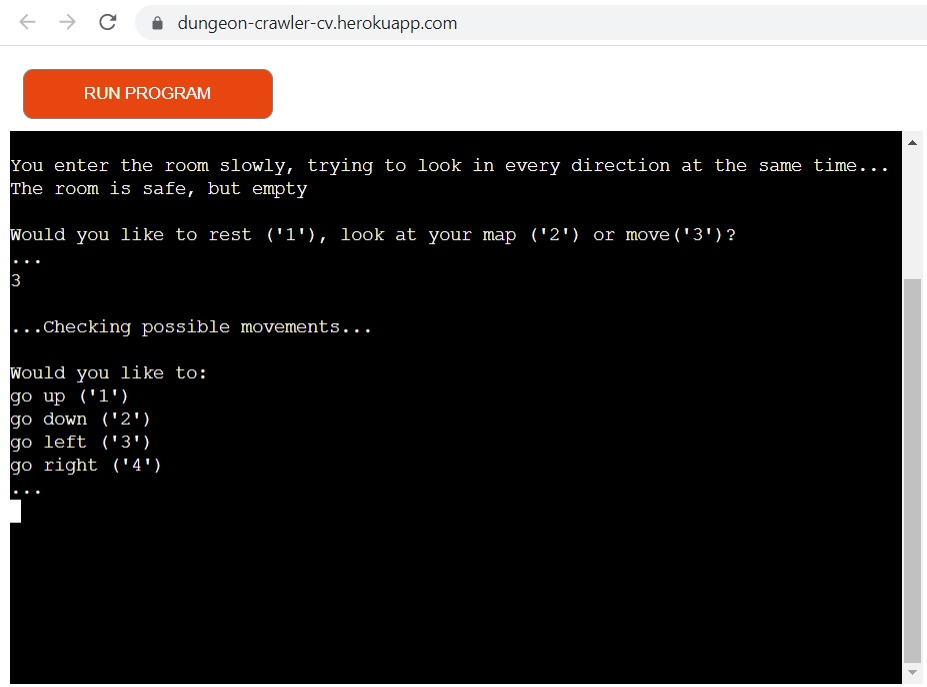
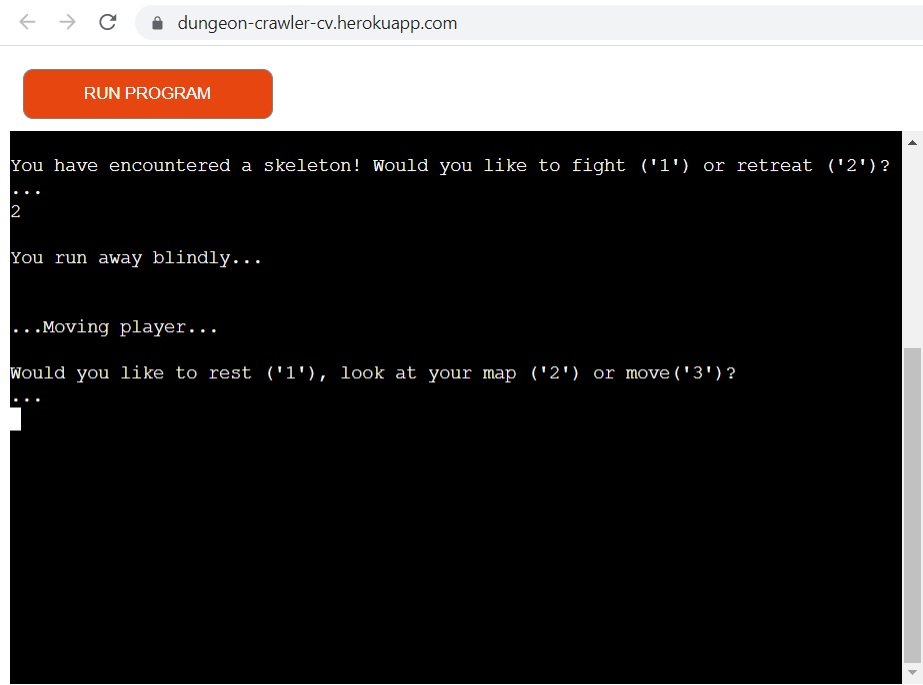
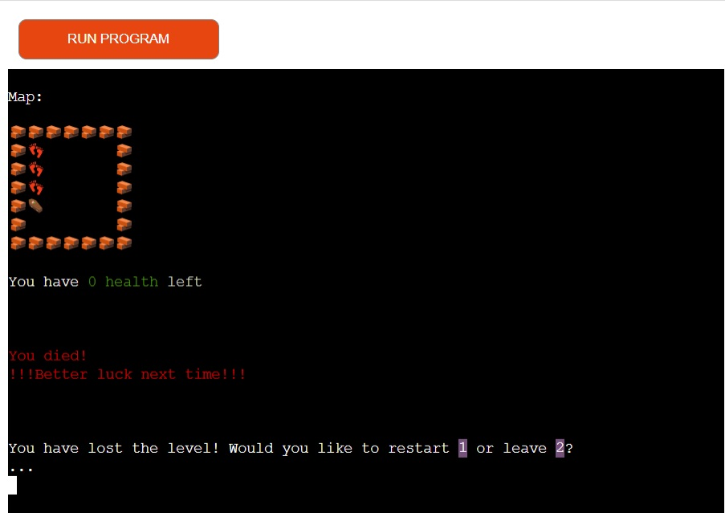
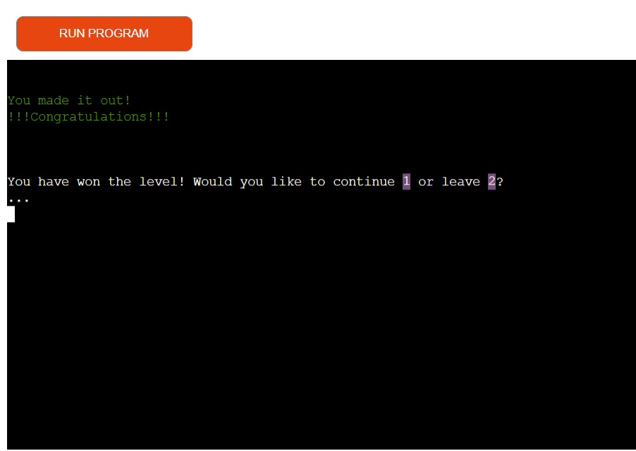
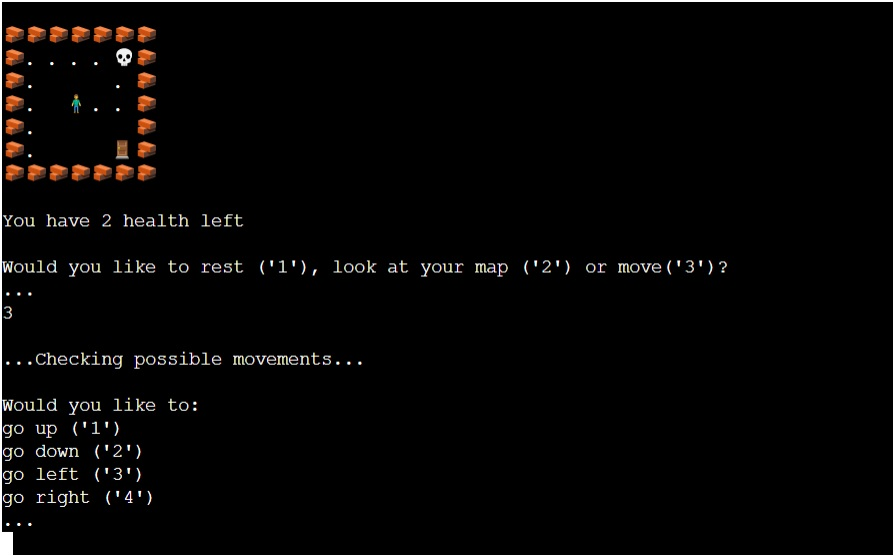
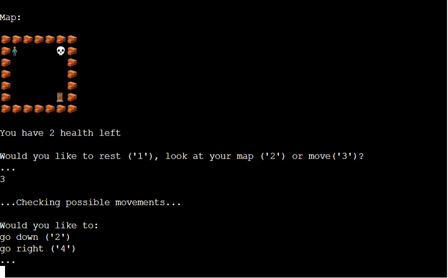
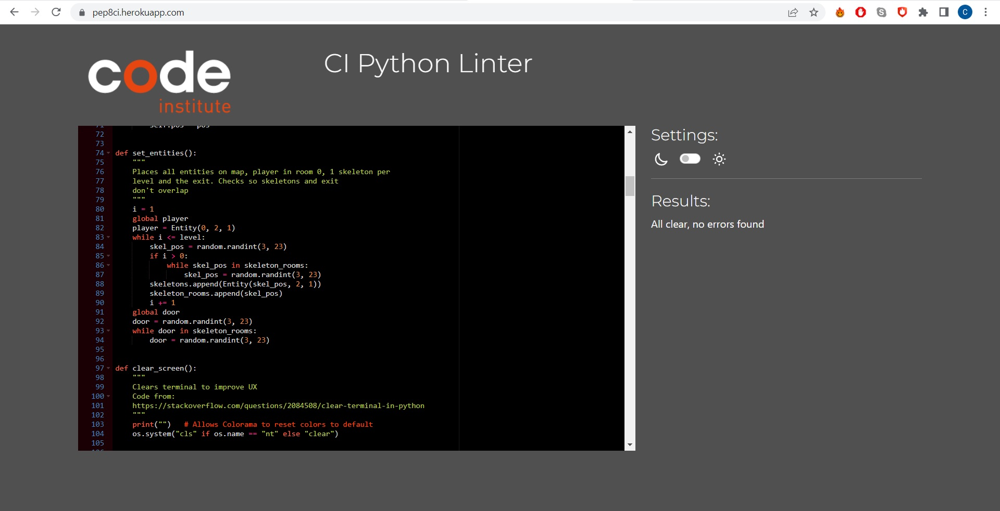

# Coco's Dungeon Crawler

This is a dungeon crawler style text based game developped in Python. The aim of the game is for the player to navigate through the dungeon to find the exit. Along the way they might find enemy skeletons which they will have to fight or evade.


## Features

This game is a text based adventure. The player is asked to make a choice, wether which direction to go, if they want to rest (possibility to gain health) or if they want to fight a skeleton or try to evade it. The game then calculates and informs the player on the results of their decision

### How the game works

- __I - Starting page__

The starting page offers the player a menu style choice, letting them choose between starting the game, reading the rules and the credits.


  - __Rules__
    
Here the rules of the game are explained to the player. The end game - finding the exit - is explained as well as the steps to achieve this and the challenges that can be found along the way.


  - __Credits__

Informs the player about who developped the game and how to best enjoy it.


- __II - Decision time__

At the start of the game, the player is presented with three choices:
- Rest - one in ten chance of gaining 1 health, otherwise nothing happens


- Look at map - the player can look at the map. They will see their current position as well as all the rooms previously visited. If a room contained a skeleton and the player fled, the skeleton will be visible on the map


- Move - guides the player through the movement phase


- __III - Movement time__

The player is presented with two to four directions they can go. Possible directions are calculated by the program and only valid options can be selected.


- __IV - Movement result__

There are three possible outcomes to any move the player makes:
- The room is empty - player is presented with new decision time
- The room contains a skeleton - player is presented with a fight or flight option
- The room contains the exit - player wins


- __V - Skeleton encounter__

The player is given a choice to fight or flee. Results are as follows:
- If the player decides to flee, they have a 50% chance of success, in which case they will move in a random possible direction, and be sent back to decision time. If the escape fails, they are forced to fight the skeleton


- If the player decides to fight, the program assigns random hits until either the player or the skeleton runs out of health. Hits are programmed as follows:
        - 10% - both the player and skeleton hit
        - 10% - player deals a critical hit (2x damage)
        - 20% - the skeleton hits the player
        - 60% - the player hits the skeleton


- __VI - End of game__

The game ends in one of two ways:
- The player is defeated by a skeleton, they die.

- The player finds the exit, they win.
The player can then decide to play again or exit the program



### Existing Features

- __Map__

The map is created by generating 25 rooms. Each room is an object with:
- a position: allows to select particular rooms
- a status: dark (room hasn't been visited), empty (room visited), player, skeleton or door (exit)
- contents: currently not used but will be able to hold items such as a sword, shield or key
Only visited rooms are visible to the player when they open the map in-game. Walls are present to indicate the size of the map and show limits.

```Python
class Room:
    """
    Creates an empty, dark room
    status matches legend options
    sontents to add future objects (sword, shield...)
    pos
    """
    def __init__(self, status, contents, pos):
        self.status = status
        self.contents = contents
        self.pos = pos
```


- __Entities__

Entities are created as objects. This allows to give them a position, health level and attack strength.

```Python
class Entity:
    """
    Creates an entity, player, enemy...
    """
    def __init__(self, pos, health, attack):
        self.pos = pos
        self.health = health
        self.attack = attack
```

- __Movement__

The position of the player is checked at each turn, dependant on the room's position, it is determined which directions the player can move. Only possible directions are offered to the player and can be selected.

- __Fight or flight__

Player is presented with the choice to fight or run away when they enter a room containing a skeleton. Success chances of an escape are 50%.

- __Fight__

Results of a fight are randomly generated by assigning a random value and comparing it to our possible outcomes. Choice of percentages has been made to keep fights interesting with different possible outcomes.

- __Flight__

When the escape is successful, player is moved in a random direction ot keep spirit of flight.

- __Error handling__

When an input is asked for, the request will be repeated until a correct option is given. This is achieved through a "while True" loop.

```Python
while True:
        i = input("\n...\n")
        if i in ("1", "2", "3"):
            break
        print(f"{i} is not an option, let's be nice and follow the guide\n")
```


### Features Left to Implement

-  Add skeleton movement. 
-  Add different types of enemies.
-  Add item system: sword, bow, shield...
-  Increase map size and add randomly generated walls to increase challenge.
-  Set up health potions instead of resting system, or limit resting.


## Testing

### Troubleshooting

A variety of testing has been done during the development process. The two main areas of focus at the start were:
- Player movement: the correct movement, positioning and verification of player's movement are paramount for this game to work.
#### From bottom-left corner:

#### From middle of bottom row:

#### From middle of left column:

#### From middle of map:

#### From middle of right column:

#### From top-left corner:

#### From middle of top row:

#### From top-right corner:


- Defensive design for user inputs: efficient handling of inputs is crucial. As inputs are done through keyboard there are an infinity of options for the player. Ensuring only valid inputs are tackled by the program avoiding any script running in the background. Any wrong input is fed back to the user, so they understand what happened.
#### Menu:

#### Rules:

#### Credits:

#### Decision:

#### Direction:

#### Fight or flight:

#### End of game:


### Known issues:
- If the player inputs "Ctrl + C" during the game, it creates a keyboard interruption, ending the program.

- On Mozilla Firefox browser, emojis are cut in half

- If the player fails to flee and loses against the skeleton, screen jumps straight to defeat screen. Difficult to follow what happened for player.

### Tools and technologies used

A number of tools were used for this project:
- Programming - Python
- Software - Heroku, GitHub, GitPod, GitHub issues
Link to Open Issues: https://github.com/Corentin-Vidick/DungeonCrawler/issues

Link to Closed Issues: https://github.com/Corentin-Vidick/DungeonCrawler/issues?q=is%3Aissue+is%3Aclosed

    - Validators - https://pep8ci.herokuapp.com/

### Validation

- Python:



## Deployment

Code Institute has provided a [template](https://github.com/Code-Institute-Org/python-essentials-template) to display the terminal view of this backend application in a modern web browser. This is to improve the accessibility of the project to others.

The live deployed application can be found deployed on [Heroku](https://dungeon-crawler-cv.herokuapp.com/).

### Local Deployment

*Gitpod* IDE was used to write the code for this project.

You can clone the repository by following these steps:

1. Go to the [GitHub repository](https://github.com/Corentin-Vidick/DungeonCrawler) 
2. Locate the Code button above the list of files and click it 
3. Select if you prefer to clone using HTTPS, SSH, or GitHub CLI and click the copy button to copy the URL to your clipboard
4. Open Git Bash or Terminal
5. Change the current working directory to the one where you want the cloned directory
6. In your IDE Terminal, type the following command to clone my repository:
	- `git clone https://github.com/Corentin-Vidick/DungeonCrawler.git`
7. Press Enter to create your local clone.

Alternatively, if using Gitpod, you can click below to create your own workspace using this repository.

[](https://gitpod.io/#https://github.com/Corentin-Vidick/DungeonCrawler)

Please note that in order to directly open the project in Gitpod, you need to have the browser extension installed. A tutorial on how to do that can be found [here](https://www.gitpod.io/docs/configure/user-settings/browser-extension).

### Heroku Deployment

This project uses [Heroku](https://www.heroku.com), a platform as a service (PaaS) that enables developers to build, run, and operate applications entirely in the cloud.

Deployment steps are as follows, after account setup:

- Select *New* in the top-right corner of your Heroku Dashboard, and select *Create new app* from the dropdown menu.
- Your app name must be unique, and then choose a region closest to you (EU or USA), and finally, select *Create App*.
- From the new app *Settings*, click *Reveal Config Vars*, and set the value of KEY to `PORT`, and the value to `8000` then select *add*.
- Further down, to support dependencies, select *Add Buildpack*.
- The order of the buildpacks is important, select `Python` first, then `Node.js` second. (if they are not in this order, you can drag them to rearrange them)

Heroku needs two additional files in order to deploy properly.
- requirements.txt
- Procfile

You can install this project's requirements (where applicable) using: `pip3 install -r requirements.txt`. If you have your own packages that have been installed, then the requirements file needs updated using: `pip3 freeze --local > requirements.txt`

The Procfile can be created with the following command: `echo web: node index.js > Procfile`

For Heroku deployment, follow these steps to connect your GitHub repository to the newly created app:

- In the Terminal/CLI, connect to Heroku using this command: `heroku login -i`
- Set the remote for Heroku: `heroku git:remote -a <app_name>` (replace app_name with your app, without the angle-brackets)
- After performing the standard Git `add`, `commit`, and `push` to GitHub, you can now type: `git push heroku main`

The frontend terminal should now be connected and deployed to Heroku.


## Credits

- All emoticons taken from https://emojipedia.org/
- clear() function from https://stackoverflow.com/questions/2084508/clear-terminal-in-python
- Object understanding through https://www.w3schools.com/python/python_classes.asp
- Use of colorama from https://www.youtube.com/watch?v=u51Zjlnui4Y&ab_channel=TechWithTim

- Intellectual property
  - All images and text are property of the developer, Corentin Vidick
  - GitPod repository can be found at [Dungeon Crawler repository](https://github.com/Corentin-Vidick/DungeonCrawler) solely developed by Corentin Vidick from 21/11/2022.